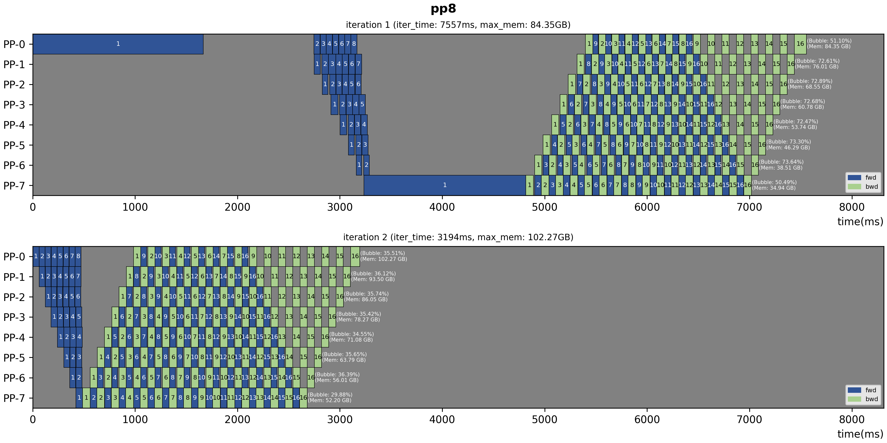
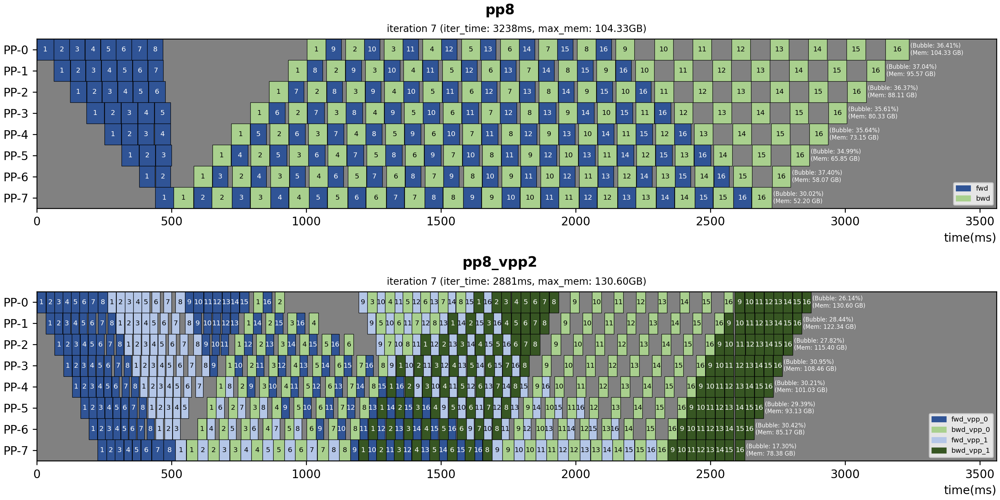

# Overview

This is a visualization tool for pipeline parallelism debug and analysis, helping users to easily find pp-related performance bottlenecks and optimization possibilities.

## Quick Start

1. Dump pp schedule data to `output/pp_data` with `args.dump_pp_data` in training task
    ```bash
    output/pp_data
    ├── config.json
    ├── pp_rank_0.json
    ├── pp_rank_1.json
    └── ...
    ```

2. Build local python environment on PC
    ```bash
    pip install -r requirements.txt
    ```

3. Configure `task_list` in `vis.py`
    ```python
    task_list = [
        {
            "title": "pp8",
            "iter_to_vis": [i for i in range(7, 8)],
            "log_path": "pp_data_example/gpu8_layer64_gbs16/pp8",
        },
        {
            "title": "pp8_vpp2",
            "iter_to_vis": [i for i in range(7, 8)],
            "log_path": "pp_data_example/gpu8_layer64_gbs16/pp8_vpp2",
        },
    ]
    ```

4. Run visualization
    ```bash
    python vis.py
    # Then open http://127.0.0.1:8988 on browser
    ```
## Examples

- Visualize different iterations in one training task
    ```python
    task_list = [
        {
            "title": "pp8",
            "iter_to_vis": [i for i in range(1, 3)],
            "log_path": "pp_data_example/gpu8_layer64_gbs16/pp8",
        },
    ]
    ```
    
- Visualize different schedules among training tasks
    ```python
    task_list = [
        {
            "title": "pp8",
            "iter_to_vis": [i for i in range(7, 8)],
            "log_path": "pp_data_example/gpu8_layer64_gbs16/pp8",
        },
        {
            "title": "pp8_vpp2",
            "iter_to_vis": [i for i in range(7, 8)],
            "log_path": "pp_data_example/gpu8_layer64_gbs16/pp8_vpp2",
        },
    ]
    ```
    
